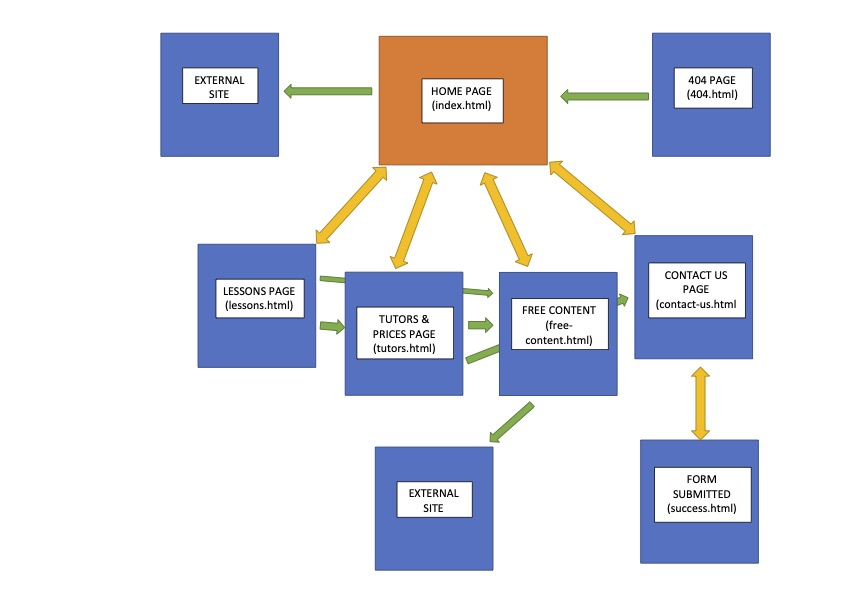
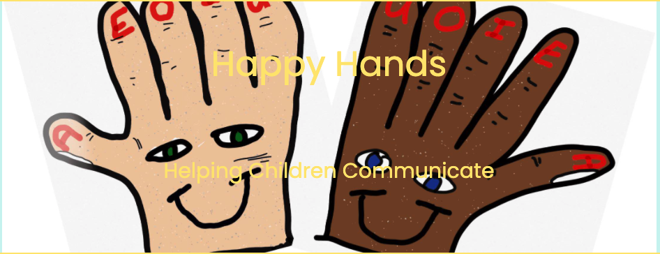
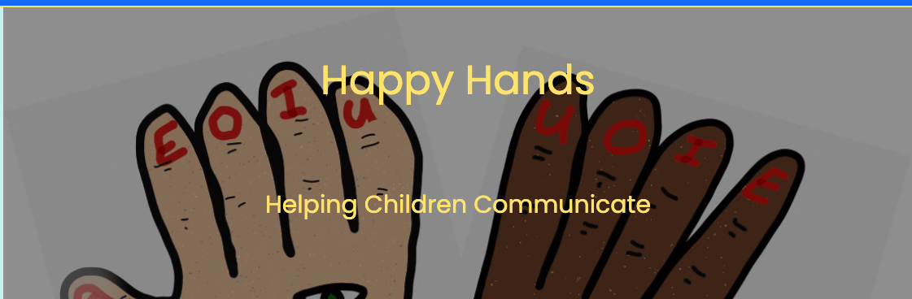
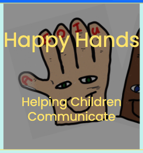
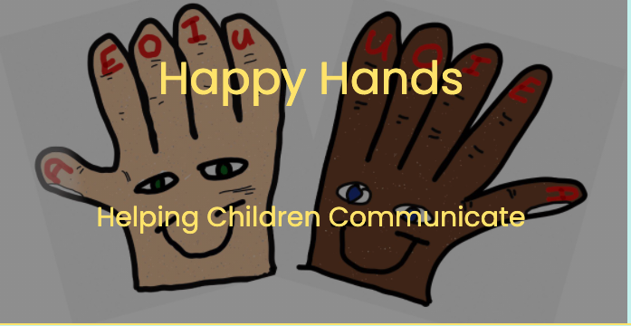
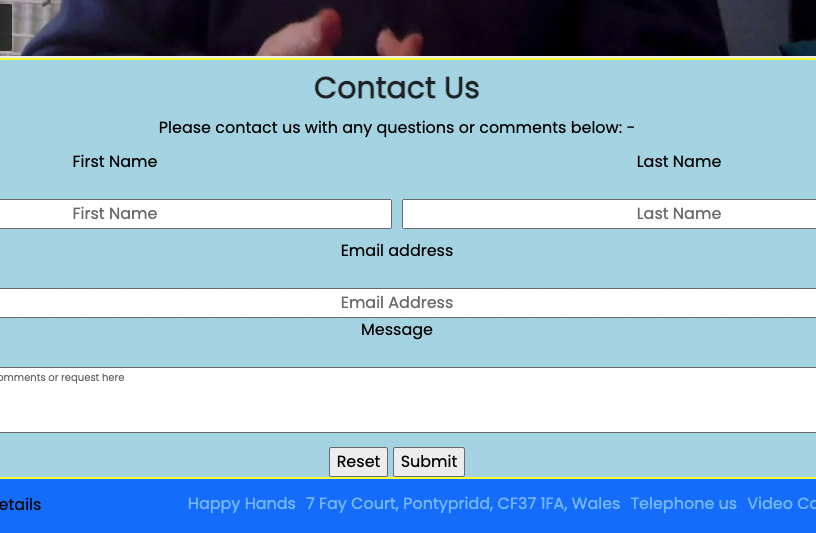
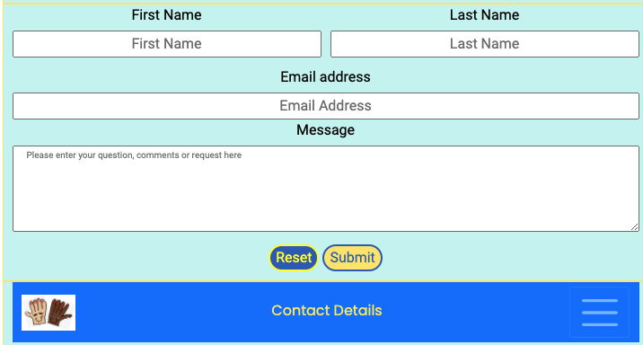
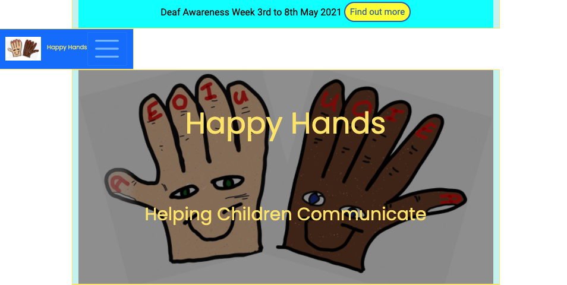
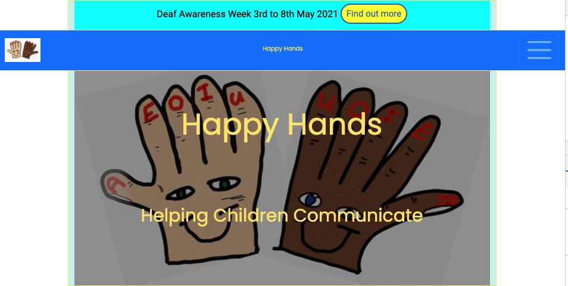
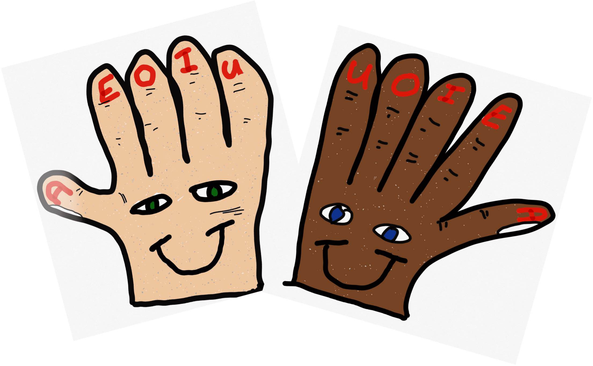

# Happy Hands - Testing document

[README.md file](/README.md)

## Table of contents
1. [Validation Testing](#validation-testing)
2. [Lighthouse Testing](#lighthouse-testing)
   * [Mobile Phone](#mobile-phone)
   * [Desktop](#desktop)
3. [Manual Testing](#manual-testing)
   * [All Pages](#all-pages)
   * [index.html](#index)
   * [lessons.html](#lessons)
   * [free-content.html](#free-content)
   * [contact-us](#contact-us)
      * [form in contact us](#contact-us-form)
   * [success.html](#success)
   * [404.html](#404)
4. [User Story Testing](#user-story-testing)
5. [Bugs](#bugs)
   * [Github](#github)
   * [Hero Image](#hero-image)
   * [Buttons](#buttons)
   * [Navigation Bar](#navigation-bar)
   * [Footer Errors](#footer-errors)

## Validation Testing
* [html testing with W3C Markup Validation Service](https://validator.w3.org/)
  * [index.html](/assets/images/testing-images/index.html.pdf)
  * [lessons.html](/assets/images/testing-images/lessons.html.pdf)
  * [tutors.html](/assets/images/testing-images/tutors.html.pdf)
  * [free-content.html](/assets/images/testing-images/free-content.html.pdf)
  
  The following pages had no html errors as the main content and code of these pages were created after the initial testing of the first four pages.
  * contact-us.html
  * success.html
  * 404.html

* [css testing using W3C CSS Validation Service](https://jigsaw.w3.org/css-validator/)

All CSS code was put through the W3C Validation Service. The following message was shown: -

[Back to content](#table-of-contents)
## Lighthouse Testing
### Mobile phone
#### (1st test)
  * [index.html](/assets/images/testing-images/lighthouse-index-1st.png)
  * [lessons.html](/assets/images/testing-images/lighthouse-lessons-1st.png)
  * [tutors.html](/assets/images/testing-images/lighthouse-tutors-1st.png)
  * [free-content.html](/assets/images/testing-images/lighthouse-free-content-1st.png)
  * contact-us.html(test missing)
    * [success.html](/assets/images/testing-images/lighthouse-success-1st.png)
    * [404.html](/assets/images/testing-images/lighthouse-404-1st.png)

The main issues were the performance and Best Practices which both scored under 90% on all pages. The errors were mainly that the pictures were too big and that external links had no 'rel' values. 

I fixed this by reducing the sizes of the images used and by adding 'rel="noopener"' to any external links (call-out buttons).

#### (2nd test)
* [index.html](/assets/images/testing-images/lighthouse-index-2nd.png)
* [lessons.html](/assets/images/testing-images/lighthouse-lessons-2nd.png)
* [tutors.html](/assets/images/testing-images/lighthouse-tutors-2nd.png)
* [free-content.html](assets/images/testing-images/lighthouse-free-content-2nd.png)
* [contact-us.html](/assets/images/testing-images/lighthouse-contact-us-2nd.png)
   * [success.html](assets/images/testing-images/lighthouse-success-2nd.png)
   * [404.html](/assets/images/testing-images/lighthouse-404-2nd.png)

After the fixes described above all scores accross all pages were over 90% with my index.html scoring 94%. With more time and manipulation I think I could have got all scores over 95%. Most of the issues were in Best Practices for the image used in the nav bar and hero-image, as well as some cookie issues with the videos in both the lessons and free-content.html.

I also noticed that running more than one lighthouse test on each page delivered a different set of results, so was unsure if any extra work on these pages, would have a major inpact on my scores.
 
### Desktop
* [index.html](assets/images/testing-images/desktop-index.html.png)
* [lessons.html](assets/images/testing-images/desktop-lessons.html.png)
* [tutors.html](assets/images/testing-images/desktop-tutors.html.png)
* [free-content.html](assets/images/testing-images/desktop-free-content.html.png)
* [contact-us.html](assets/images/testing-images/desktop-contact-us.html.png)
   * [success.html](assets/images/testing-images/desktop-success.html.png)
   * [404.html](assets/images/testing-images/desktop-404.html.png)

[Back to content](#table-of-contents)
## Manual Testing  

The layout of the website is as follows: -

The most common path through the website is: -
* Home > Lessons > Tutors > Free Content > Contact Us
  * On completion of the form in Contact Us > Success (Thank You)
  * On entering the wrong address in the web browser > 404.html

### All Pages
**Each page contains a navigation bar at the top of the page.**
* Expectation: -  
  * A user can go directly to any part of the website by clicking the relevant page link within the navigation bar. 
  * On a mobile device, this will mean clicking the 'hamburger' icon, which will then display all the pages for a user to choose from.
* Test: - Each page link was clicked to go to the chosen page, i.e. Lessons clicked should take user to lessons.html.
* Result: - Each page link took me to the page I had clicked on. No link was broken and each page was reachable as intended.
* Verdict: - Working as intended

**Each page contained an image and 'Happy Hands' text within the navigation bar in the header**
* Expectation: - The picture icon/image and 'Happy Hands' text should take a user back to the home (index.html) page
* Test: - I clicked both the image and the text on every page
* Result: -  I then directed me back to the home (index.html) page, i.e - clicking the 'Happy Hands' text on Lessons (lessons.html) directed me back to the Home (index.html) page
* Verdict: - Working as intended

**Each page also contained an image/icon of Happy Hands within the footer**
* Expectation: - The picture icon/image should take a user back to the home (index.html) page
* Test: - I clicked the image on every page
* Result: - I was then directed back to the home (index.html) page, i.e - clicking the 'Happy Hands' image on Lessons (lessons.html) directed me back to the Home (index.html) page
* Verdict: - Working as intended

**Each page also contains the following links within the navigaiton bar in the footer**
1. Contact Us
   * Expectation: - A user clicks the 'call-out' button and is directed to the 'Contact Us' (contact-us.html) page
   * Test: - Click the link on every page and be directed to the 'Contact Us' (contact-us.html) page
   * Result: - I clicked this button on every page and was directed to the correct page
   * Verdict: - Working as intended
2. Visit Us/Address
   * Expectation: - Clicking this link should take users to a Google Map
   * Test: - Click the link on every page
   * Result: - Clicking this link opened up a new tab with Google Maps
   * Verdict: - Working as intended
3. Telephone Us
   * Expectation: - Clicking this link should allow users to make a phone call to the business if their browser allows (i.e. Facetime)
   * Test: - Clicked the link on every page
   * Result: - Clicking this link opened up a possible Facetime phone call
   * Verdict: - Working as intended
4. Video Call Us
   * Expectation: - Clicking this link should allow users to make a video call to the business (via Zoom)
   * Test: - Clicked the link on every page
   * Result: - Clicking this link opened a new tab to and entered a zoom room
   * Verdict: - Working as intended

[Back to content](#table-of-contents)

## Buttons

**Some of the website pages contain 'call-out' buttons which help a user to navigate to a particular web page.** 

These buttons are placed in individual sections of some pages to encourage user interactivity. For example: -

### index

This has three 'call-out' buttons: -

1. The first links to an external site with more information on 'Deaf Awareness' (this was working at the time of publishing this website)
   * Expectation: - A user clicks the 'call-out' button and is redirected on a separate tab to information about Deaf Awareness (https://www.deafcouncil.org.uk/)
   * Test: - Clicked this button to read the extra information
   * Result: - I was directed to the correct website in a new tab
   * Verdict: - Working as intended
2. The second 'call-out' button links to the **'lessons.html'** page
   * Expectation: - A user clicks the 'call-out' button and is directed to the 'Lessons' (lessons.html) page
   * Test: - Clicked this button to navigate to the Lessons page
   * Result: - I was directed to the correct page
   * Verdict: - Working as intended
3. The third 'call-out' button links to the **'tutors.html'** page.
   * Expectation: - A user clicks the 'call-out' button and is directed to the 'Tutors' (tutors.html) page
   * Test: - Clicked this button to navigate to the Tutors page
   * Result: - I was directed to the correct page
   * Verdict: - Working as intended

[Back to content](#table-of-contents)
### lessons

This has three 'call-out buttons: -

1. The first button links to the **tutors.html** page
   * Expectation: - A user clicks the 'call-out' button and is directed to the 'Tutors' (tutors.html) page
   * Test: - Clicked this button
   * Result: - Directed to the Tutors page
   * Verdict: - Working as intended
2. The second button links to the **tutors.html** page
   * Expectation: - A user clicks the 'call-out' button and is directed to the 'Tutors' (tutors.html) page
   * Test: - Clicked this button
   * Result: - Directed to the Tutors page
   * Verdict: - Working as intended
3. The third button links to the **free-content.html** page
   * Expectation: - A user clicks the 'call-out' button and is directed to the 'Free Content' (free-content.html) page
   * Test: - Clicked this button
   * Result: -  Directed to the Free Content page
   * Verdict: - Working as intended

[Back to content](#table-of-contents)
### tutors
There are no call-out buttons on this page.

### free content
There is one 'call-out' button: -
1. This button links to an external site with extra free content.
   * Expectation: - A user clicks the 'call-out' button and is redirected on a separate tab to information about free resouces (https://letssign.co.uk)
   * Test: - Clicked this button
   * Result: -  I was directed to the correct website
   * Verdict: - Working as intended

### contact us
There are two 'call-out' buttons: -
1. The first **reset** button resets the form and deletes any input from the user in the form above
   * Expectation: - A user fills in the form, makes an error and clicks the 'call-out' **Reset** button and deletes any input from the user in the form above
   * Test: - I entered some dummy information and clicked the **Reset** button
   * Result: - The information was cleared
   * Verdict: - Working as intended
2. The second **submit** button 'sends' the information in the form and displays a **success.html** page
   * Expectation: - A user fills in the form correctly and clicks the 'call-out' **Submit** button and is directed to the 'Success' (success.html) page
   * Test: - I filled out all form sections correctly and clicked this button
   * Result: -  I was directed to the Success page
   * Verdict: - Working as intended

[Back to content](#table-of-contents)
#### form
This form contained 4 fields to be filled in by the user. All fields were set to **'required'**

**First Test - Correct Information added to all fields**
1. First Name - Text entered
2. Last Name - Text entered
3. Email Address - Text entered with an "@" email dummy address
4. Message - Text entered
   * Expectation: - Entering text in the right format in all fields and then pressing Submit button allows the form to be 'Submitted' and directs to **Success** (success.html) page
   * Test: - Filled in form using my name, email address and dummy message
   * Result: - I was directed to a new page with a 'Thank You' message (success.html)
   * Verdict: - Working as intended

**Second Test - Incorrect Information missing**
1. First Name - Text 'NOT' entered
2. Last Name - Text entered
3. Email Address - Text entered with an "@" email dummy address
4. Message - Text entered
   * Expectation: - Missing text in the right format in the 'First Name' field and then pressing the **Submit** button brings up an error message and won't submit the form.
   * Test: - Filled in form without filling in the 'First Name' field and using my last name only, email address and dummy message
   * Result: - A warning message displayed asking me to fill in the 'First Name' field
   * Verdict: - Working as intended

**This test was repeated for 'Last Name', 'Email Address' and 'Message' with the same warning/error message. The form would not allow me to submit with missing fields.**

Verdict: - Working as intended

**Email Address - '@' symbol must be used** 
* Expectation: - Incorrectly entering an email address without the '@' symbol displays an error
* Test: - Entered a dummy email address without the '@' part of the address
* Result: - An error/warning message was displayed asking me to type an email address with a '@' symbol
* Verdice: - Working as intended. The form would not allow me to submit with a missing '@' symbol

[Back to content](#table-of-contents)
### success
There is one 'call-out' button: -
1. This button allows the user to return back to the **contact-us.html** page
   * Expectation: - Clicking on the 'call-out' button directs the user back to the 'Contact Us' (contact-us.html) page
   * Test: - Clicked the 'call-out' button
   * Result: - I was taken to the 'Contact Us' (contact-us.html) page
   * Verdict: - Working as intended

### 404
There is one 'call-out' button: -
1. This button allows the user to navigate back to the **index.html** of the main website
   * Expectation: - Clicking on the 'call-out' button takes user to the 'Home' (index.html) page
   * Test: - Clicked the 'call-out' button
   * Result: - Each time the button was clicked I was directed to the 'Home' (index.html) page
   * Verdict: - Working as intended

[Back to content](#table-of-contents)
## User Story Testing

The following are the User Stories from the README.md page and the resulting Test and Result
* As a user visiting the site for the first time:
  1. I want to be able to use the website on any device I own or use
     * Test: - I tested the website on a Samsung Note 8, an iPad Pro and a MacBook Pro 2021 model
     * Result: - The website worked on all devices
     * Verdict: - Success
  2. I want to able to learn and easily understand what the website is about
     * Test: - To make sure that all headers, paragraphs and other content was clear and readable
     * Result: - I created the website using Bootstrap v.4 and the "row" and "col" tags to make the site responsive to all devices, but especially mobile
     * Verdict: - Success
  3. I want to easily understand about the courses provided
     * Test: - The **Lessons** 'Call-out' button on the 'Home' (index.html) page and within the navigation bar were clicked
     * Result: - Clicking the 'call-out' button and/or using the links within the navigation bar directed to the 'Lessons (lessons.html) page. Some additional information about the classes/courses was provided on the 'Home' page (index.html)
     * Verdict: - Success
  4. I want an attractive home page introducing HAPPY HANDS
     * Test: - Every page shoudl have a hero image and page header title text and subheading
     * Result: - A hero image and text appeared on every page
     * Verdict: - Success
  5. I want to click on navigation links to be taken to the correct page/section and to be able to return to the home page or another page without using the brower forward/backward buttons
     * Test: - Each link was tested for each page, i.e. the 'Lessons' text directs me to the 'Lessons' (lessons.html) page
     * Result: - Each link directed to the correct page
     * Verdict: - Success
  6. I want these navigation links to include user friendly menus which are easy to uderstand and use
     * Test: - I tested the navigation links on a Samsung Note 8, an iPad Pro and a MacBook Pro 2021 model
     * Result: - The navigation links worked on all devices
     * Verdict: - Success
  7. I want the content to be easy to read and have a predictable layout so that each page can be navigated easily
     * Test: - I tested the website on a Samsung Note 8, an iPad Pro and a MacBook Pro 2021 model
     * Result: - The website worked on all devices and was responsive so that all content was easily readable
     * Verdict: - Success
  8. I want to be able to click and visit social media, Facebook, Twitter and others for more content and to keep up to date with future postings and developments
     * Test: - Clicked all the social media 'Font Awesome' icons
     * Result: - Each icon directed to a new tab which matched the icon and link text
     * Verdict: - Success
  9. I want to access sample lessons and other content for various age ranges
     * Test: - User controls and no autoplay on any video content
     * Result: - No video autoplayed on website loading
     * Verdict: - Success
  10. I want to provide make contact with the business owner for more information
      * Test: - The 'Contact Us' links in the top Navigation and Footer bars directed to the 'Contact Us' (contact-us.html) page
      * Result: - The links directed to the correct page
      * Verdict: - Success
  11. I want to see the people involved with teaching the lessons
      * Test: - To make sure images of the tutors loaded correctly
      * Result: - Images loaded in the correct sections
      * Verdict: - Success
  12. I want to see reviews and testimonials from other users
      * Test: - To make reviews stand out from other content
      * Result: - The reviews are styled separately from other content
      * Verdict: - Success
  13. I want to access contact information, such as address, phone numbers and location
      * Test: - To click and be directed to a map and a phone call
      * Result: - A map loads but doesn't not have an address marked. This was corrected by supplying the address in the text for this clickable link.
      * Verdict: - Phone number successful. Map required some additional work - corrected by having address as text.
  14. I want to be able to access this information if I am deaf and rely on BSL
      * Test: - To click and be directed to a video call
      * Result: - Clicking the 'Video Call Us' link opens a new tab for a Zoom video call
      * Verdict: - Success
  15. I want to know the price for and time for each lessons
      * Test: - To find prices
      * Result: - Prices included in bottom section of 'Tutors' (tutors.html) page
      * Verdict: Partially Successful. Preferred options would have been an additional download, or call-out button. May have time to implement post-testing
  16. I want to know that my child is safe and that tutors have the necessary qualificaitons and checks in place
      * Test: - To easily find information about the teachers/tutors
      * Result: - Links to the Tutors (tutors.html) page is available within the navigation bar and on the 'Home' (index.html) page
      * Verdict: - Success

* For the above, when designing the website I did the following to resolve the User Story desires:-
  1. Design a responisive website focussed for mobile devices and responsive to larger screens.
  2. Design an easy to read home page (index.html) which gives some brief information about the website and it's aims and goals
  3. Design 2 distinct sections which highlight the language (BSL) and the courses available
  4. Design 1 section on the home page about the company Happy Hands as an 'about us'
  5. Design and impliment a navigation bar which contains links to different pages and sections in the website 
  6. Design and label the navigation bar with clear and understandable text to direct users to the correct page  
  7. Design the website to have good readability throughout and avoid using black on white text for those with Meares-Irlen Syndrome, Dyslexia or other reading difficulties
  8. Design Social Media interactive buttons which direct user to the social media platform they wish to interact with.
  9. Design and create videos and packs for users to watch and download  
  10. Design a contact form which can be submitted (or cleared if errors made)
  11. Design a 'tutors.html' page with information on teachers 
  12. Design a reviews and testimonials section
  13. Design a footer with contact details such as address, phone number and location via a map 
  14. Design a link in the footer to a Zoom call for BSL users and video content
  15. Design a section within the lessons.html page with information on prices and times
  16. Design a seciton within the tutors.html and index.html which offers confirmation of checks and tutor information

* As a user returning to the site:
  1. I want to be able to watch video content provided by the business
     * Test & Result: - All videos work correctly
  2. I want to be able to easily find content I am interested in
     * Test & Result: - All content is easily found by means of a 'Sticky Navigation bar'
  3. I want to be able to contact the business owner by various means, such as contact form, social media, video call, etc
     * Test & Result: - All these details are at the bottom of each page as Social Media (Font Awesome) Icons. There is also a contact form on the 'Contact Us'(contact-us.html) page accessed from the top and bottom navigation bars and from the Tutors page

* For the above, when designing the website I did the following to resolve the Returning User Story desires:-
  1. Design and provide embedded YouTube videos with user controls
  2. Design an easy to use and friendly navigation bar and clickable buttons on each page
  3. Design a contact form section/page. Also provide social media buttons and a contact us on each page at the bottom

[Back to content](#table-of-contents)
## Bugs

### Github
Problems committing to GitHub.
* During the first week of using GitPod I encoutered issues commiting and pushing the work I was doing on my website. I therefore created the following [report](/assets/images/readme-images/website-design-steps)

### Hero Image
The Hero Image
* On each page the hero image was too bright which made reading the header text and subheading very difficulties
    

      > .hero-image {
      background: url(../images/logos-images/happy-hands.jpg) no-repeat center center;
      background-size: cover;
      height: 36rem;
      width: 100%;
      position: relative;
      }
* On correcting this I found some code from css-tricks which made the image darker, however, the image would not stay center and adding 'center center' to this new code didn't work.
    
   
  * This was even worse on a mobile device: -

   
 
        .hero-image {
        background-image: linear-gradient(rgba(0, 0, 0, 0.40),
            rgba(0, 0, 0, 0.40)),
        url(../images/logos-images/happy-hands.jpg);
        /*background-image influenced by css-tricks.com*/
        background-size: cover;
        height: 36rem;
        width: 100%;
        position: relative;
        }

* By combining these two codes I was able to produce a hero image I wanted: -
  

      .hero-image {
      background: url(../images/logos-images/happy-hands.jpg) no-repeat center center;
      background-image: linear-gradient(rgba(0, 0, 0, 0.40),
            rgba(0, 0, 0, 0.40)),
        url(../images/logos-images/happy-hands.jpg);
      /*background-image influenced by css-tricks.com*/
      background-size: cover;
      height: 36rem;
      width: 100%;
      position: relative;
      }

[Back to content](#table-of-contents)
### Buttons
The buttons on my form were not appearing the same as the other buttons on my website although the code was the same: -

* Existing code from Bootstrap (adapted by me for colour, style, position, etc): -

      .btn {
      /*influenced by Bootstrap*/
      background-color: #FFFB0F;
      border: 2px solid #3066BE;
      border-radius: 2rem;
      color: #3066BE;
      margin-bottom: 1rem;
      text-align: center;
      font-size: 1.5rem;
      margin-top: .5rem;
      }
* However, the **Reset** and **Submit** buttons looked like this: -

* My mentor helped with some ideas and eventually I decided to style each button for the form separately: -
       
      .btn-reset {
      background-color: #3066BE;
      border: 2px solid #FFFB0F;
      border-radius: 2rem;
      color: #FFFB0F;
      margin-bottom: 1rem;
      text-align: center;
      }

      .btn-submit {
      background-color: #FFE66D;
      border: 2px solid #3066BE;
      border-radius: 2rem;
      color: #3066BE;
      margin-bottom: 1rem;
      text-align: center;
      }

This then gave me the final button design I had wanted: -

[Back to content](#table-of-contents)
### Navigation Bar
The navigation bar was not responsive and wouldn't move down when scrolling (sticky). I had tried adding a 'sticky-top' to my code in several places to try to make it work as intended. It took me quite a few tries but eventually I had a working 'sticky' nav bar.

* Original nav bar code with 'header class="container fixed"': -
        
        <header class="container fixed">
            <nav class=“navbar navbar-expand-lg navbar-dark bg-primary”>
                
                <h6 class=“yellow”>Happy Hands</h6>
                <button class=“navbar-toggler” type=“button” data-toggle=“collapse” data-target=“#navbarSurpportedContent”
                aria-controls=“navbarSurpportedContent” aria-expanded=“false” aria-label=“Toggle navigation”>
                   
                </button>
                

                    <ul class=“nav-centre navbar-nav”>
                        <li class=“nav-item active”>
                            <a class=“nav-link” href=“index.html”>Home</a>
                        </li>
                        <li class=“nav-item”>
                            <a class=“nav-link” href=“lessons.html”>Lessons</a>
                        </li>
                        <li class=“nav-item”>
                            <a class=“nav-link” href=“tutors.html”>Tutors</a>
                        </li>
                        <li class=“nav-item”>
                            <a class=“nav-link” href=“free-content.html”>Free Content</a>
                        </li>
                        <li class=“nav-item”>
                            <a class=“nav-link” href=“contact-us.html”>Contact Us</a>
                        </li>
                    </ul>
                

            </nav>
        </header>

I tried adding 'class="sticky-top" to all aspects of the navigation bar and had the following unusual results: -

Until thankfully I managed to get it all to work: -

My final code with 'nav class="sticky-top"' at the beginning of this code: -

    <nav class="sticky-top">
        

            
            <a href="index.html">
                <h6 class="yellow">Happy Hands</h6>
            </a>
            <button class="navbar-toggler" type="button" data-toggle="collapse" data-target="#navbarSurpportedContent"
                aria-controls="navbarSurpportedContent" aria-expanded="false" aria-label="Toggle navigation">
                
            </button>
            

                <ul class="nav-centre navbar-nav">
                    <li class="nav-item active">
                        <a class="nav-link" href="index.html">Home</a>
                    </li>
                    <li class="nav-item">
                        <a class="nav-link" href="lessons.html">Lessons</a>
                    </li>
                    <li class="nav-item">
                        <a class="nav-link" href="tutors.html">Tutors</a>
                    </li>
                    <li class="nav-item">
                        <a class="nav-link" href="free-content.html">Free Content</a>
                    </li>
                    <li class="nav-item">
                        <a class="nav-link" href="contact-us.html">Contact Us</a>
                    </li>
                </ul>
            

    </nav>
    
### Footer Errors
    
Footer text would show yellow. However, on clicking the text and then returning to the original page, the text was now black. The issue was a piece of css code over riding the desired effect. This was deleted.

[Back to content](#table-of-contents)
